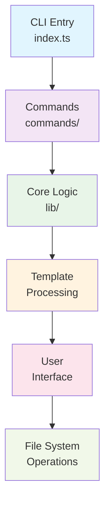
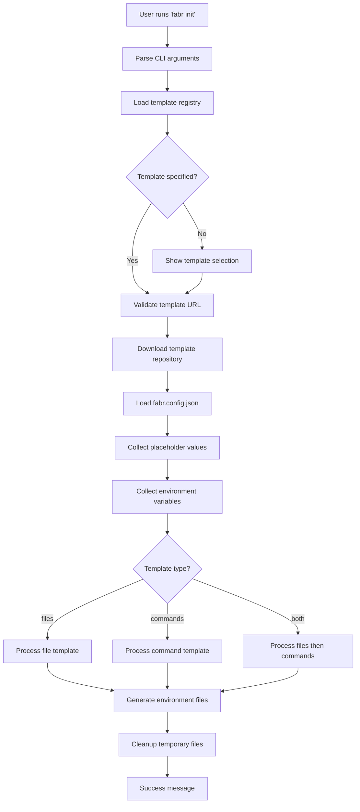
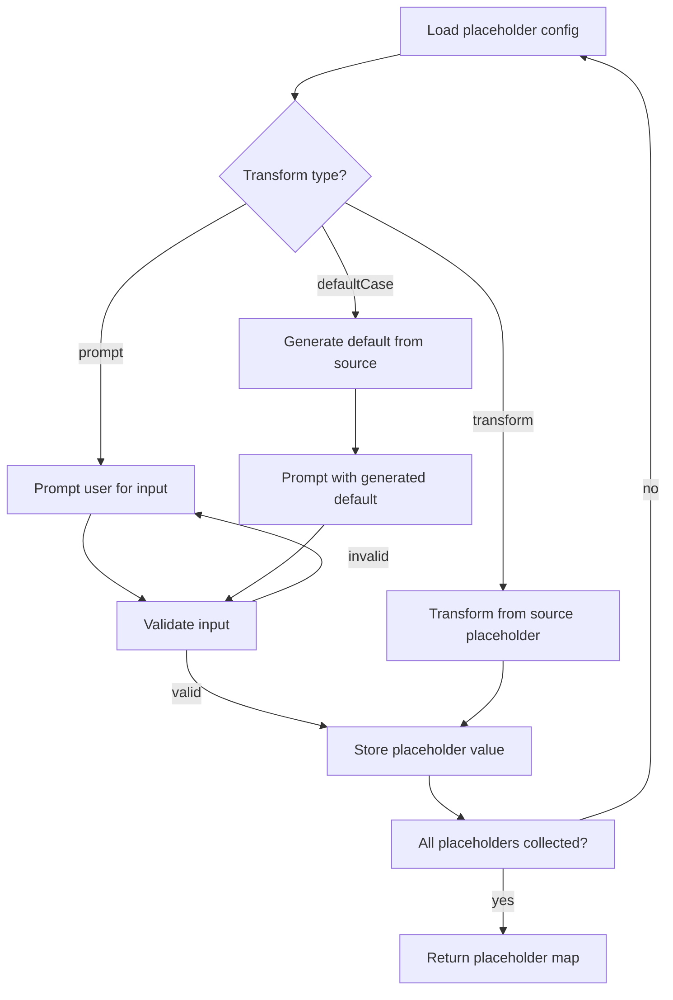

This document explains fabr's internal architecture, design decisions, and how the different components work together to create a seamless template scaffolding experience.

## Overview

Fabr is designed as a modular CLI tool with clear separation of concerns. The architecture follows these principles:

- **Simplicity** - Keep the core concepts simple and intuitive
- **Modularity** - Each component has a single responsibility
- **Extensibility** - Easy to add new features and template types
- **Reliability** - Robust error handling and validation
- **Performance** - Efficient file processing and command execution

## High-Level Architecture



## Core Components

### 1. CLI Entry Point (`src/index.ts`)

The main entry point handles:
- Command-line argument parsing
- Command routing
- Global error handling
- Process exit codes

```typescript
// Simplified flow
async function main() {
  const args = parseArgs(process.argv)
  const command = findCommand(args.command)
  await command.run(args)
}
```

### 2. Command Layer (`src/commands/`)

Each command is a self-contained module implementing the `Subcommand` interface:

- **`init.ts`** - Project creation from templates
- **`list.ts`** - Display available templates
- **`help.ts`** - Show usage information

Commands are responsible for:
- Input validation
- User interaction orchestration
- Calling appropriate core logic
- Output formatting

### 3. Core Logic (`src/lib/`)

The core modules handle the heavy lifting:

#### File Operations (`files.ts`)
- Template repository downloading
- File copying and filtering
- Binary file detection
- Placeholder replacement in file contents

#### Placeholder System (`placeholders.ts`)
- User input collection and validation
- Value transformations (case conversions)
- Default value generation
- Cross-placeholder dependencies

#### Environment Variables (`env.ts`)
- `.env` file generation
- Sensitive data handling (`.env.local`)
- Value validation and transformation

#### Command Execution (`commands.ts`)
- Shell command execution with placeholder replacement
- Working directory management
- Output capture and display
- Error handling and retries

#### User Interface (`ui.ts`)
- Consistent prompting and input collection
- Progress indicators
- Formatted output and logging
- Color and emoji support

#### Shell Operations (`shell.ts`)
- Low-level process execution
- Cross-platform compatibility
- Stream handling
- Process lifecycle management

### 4. Type System (`src/types/`)

TypeScript interfaces define the contracts between components:

- **`fabr-config.ts`** - Template configuration schema
- **`subcommand.ts`** - Command interface
- **`templates.ts`** - Template registry schema

## Data Flow

### Template Processing Flow



### Placeholder Resolution Flow



## Design Patterns

### 1. Command Pattern

Commands are implemented as objects with a consistent interface:

```typescript
interface Subcommand {
  name: string
  description: string
  run: (args: ParsedArgs) => Promise<void>
}
```

This makes it easy to add new commands without modifying existing code.

### 2. Strategy Pattern

Different template types use different processing strategies:

```typescript
async function processTemplate(config: FabrConfig) {
  if (config.type === 'commands') {
    return processCommandTemplate(config)
  } else {
    return processFileTemplate(config)
  }
}
```

### 3. Pipeline Pattern

Complex operations are broken into sequential steps:

```typescript
async function initProject(templateUrl: string, projectName: string) {
  const templatePath = await downloadTemplate(templateUrl)
  const config = await loadConfig(templatePath)
  const placeholders = await collectPlaceholders(config.placeholders)
  const envVars = await collectEnvironmentVariables(config.environmentVariables)
  await processTemplate(templatePath, projectName, config, placeholders, envVars)
  await cleanup(templatePath)
}
```

### 4. Factory Pattern

Template processors are created based on configuration:

```typescript
function createTemplateProcessor(config: FabrConfig): TemplateProcessor {
  switch (config.type) {
    case 'commands':
      return new CommandTemplateProcessor(config)
    case 'files':
    default:
      return new FileTemplateProcessor(config)
  }
}
```

## Error Handling Strategy

### 1. Structured Errors

Custom error types provide clear error categorization:

```typescript
class FabrError extends Error {
  constructor(
    message: string,
    public code: string,
    public details?: any
  ) {
    super(message)
  }
}
```

### 2. Error Boundaries

Errors are caught at appropriate levels:
- CLI level - Global error handler for unhandled errors
- Command level - Command-specific error handling
- Operation level - Specific error context and recovery

### 3. User-Friendly Messages

Technical errors are translated to user-friendly messages:

```typescript
function formatError(error: Error): string {
  if (error instanceof FabrError) {
    switch (error.code) {
      case 'TEMPLATE_NOT_FOUND':
        return 'Template not found. Please check the URL and try again.'
      case 'NETWORK_ERROR':
        return 'Network error. Please check your internet connection.'
      default:
        return error.message
    }
  }
  return 'An unexpected error occurred.'
}
```

## Performance Considerations

### 1. Lazy Loading

Components are loaded only when needed:

```typescript
// Commands are loaded dynamically
const commands = {
  init: () => import('./commands/init.js'),
  list: () => import('./commands/list.js'),
  help: () => import('./commands/help.js')
}
```

### 2. Streaming Operations

Large files and command outputs are streamed:

```typescript
// Stream large files instead of loading into memory
const readStream = fs.createReadStream(sourcePath)
const writeStream = fs.createWriteStream(targetPath)
readStream.pipe(writeStream)
```

### 3. Concurrent Operations

Independent operations run concurrently:

```typescript
// Process multiple files concurrently
await Promise.all(
  files.map(file => processFile(file, placeholders))
)
```

### 4. Efficient File Filtering

Glob patterns and early filtering reduce unnecessary processing:

```typescript
// Filter files before processing
const filesToProcess = files
  .filter(file => !isBinaryFile(file))
  .filter(file => isIncluded(file, config.files))
```

## Security Considerations

### 1. Input Validation

All user input is validated:

```typescript
function validateProjectName(name: string): boolean {
  return /^[a-z0-9-]+$/.test(name) && name.length >= 3
}
```

### 2. Safe Command Execution

Shell commands are executed safely:

```typescript
// Use spawn with argument arrays to prevent injection
spawn('npm', ['install', packageName], { stdio: 'inherit' })
```

### 3. Temporary File Cleanup

Temporary files are always cleaned up:

```typescript
try {
  await processTemplate(tempPath)
} finally {
  await fs.rm(tempPath, { recursive: true, force: true })
}
```

### 4. Sensitive Data Handling

Environment variables marked as local are kept secure:

```typescript
// Sensitive variables go to .env.local (gitignored)
if (envVar.local) {
  localEnvContent += `${envVar.key}=${value}\n`
} else {
  envContent += `${envVar.key}=${value}\n`
}
```

## Extensibility Points

### 1. Adding New Commands

1. Create command file in `src/commands/`
2. Implement `Subcommand` interface
3. Export from `src/commands/index.ts`

### 2. Adding New Template Types

1. Define new type in configuration schema
2. Create processor in `src/lib/`
3. Add routing logic to template processor

### 3. Adding New Transformations

1. Extend `CaseType` type
2. Add transformation logic to `transformCase` function
3. Update documentation

### 4. Adding New Validation Rules

1. Extend `ValidationConfig` interface
2. Add validation logic to `validateInput` function
3. Add error messages

## Testing Architecture

### 1. Unit Testing

Each module has focused unit tests:

```typescript
describe('placeholders', () => {
  test('transforms case correctly', () => {
    expect(transformCase('hello world', 'pascal')).toBe('HelloWorld')
  })
})
```

### 2. Integration Testing

End-to-end template processing tests:

```typescript
test('processes file template correctly', async () => {
  const result = await processFileTemplate(templatePath, outputPath, config)
  expect(result.success).toBe(true)
})
```

### 3. CLI Testing

Command-line interface testing:

```typescript
test('init command creates project', async () => {
  const { stdout } = await execFile('node', ['dist/index.js', 'init', 'test'])
  expect(stdout).toContain('Project created successfully')
})
```

## Deployment and Distribution

### 1. Build Process

TypeScript compilation to JavaScript:

```bash
npm run build  # tsc --build
```

### 2. Package Distribution

Published to npm with optimized bundle:

```json
{
  "files": ["dist/", "README.md", "LICENSE"],
  "main": "dist/index.js",
  "bin": {
    "fabr": "dist/index.js"
  }
}
```

### 3. Version Management

Semantic versioning with automated releases:

- Patch: Bug fixes
- Minor: New features, backward compatible
- Major: Breaking changes

## Future Architecture Considerations

### 1. Plugin System

Planned plugin architecture for extensibility:

```typescript
interface FabrPlugin {
  name: string
  version: string
  commands?: Subcommand[]
  processors?: TemplateProcessor[]
}
```

### 2. Configuration Management

Enhanced configuration with profiles:

```typescript
interface FabrProfile {
  name: string
  defaultTemplates: string[]
  placeholderDefaults: Record<string, string>
}
```

### 3. Template Registry

Centralized template discovery and management:

```typescript
interface TemplateRegistry {
  search(query: string): Template[]
  install(template: string): Promise<void>
  update(template: string): Promise<void>
}
```

This architecture provides a solid foundation for fabr's current functionality while remaining flexible enough to accommodate future enhancements and community contributions.
